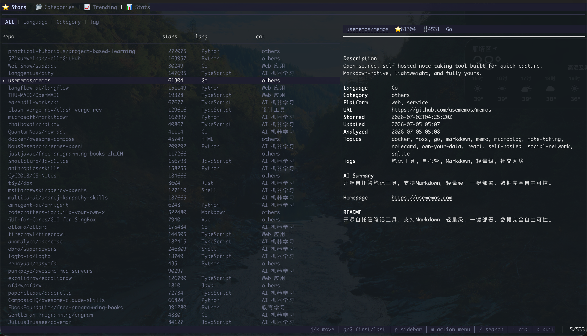

# starman

[English](README.md) | [简体中文](README.zh.md)

一个用 AI 管理 GitHub 星标仓库的 CLI 和 TUI 工具 —— 同步、分析、分类、搜索，并生成 Awesome List。

starman 支持星标同步、AI 分析、Awesome List 生成、数据备份、终端界面——全部在命令行或 TUI 中完成。

## 功能

- **TUI** — 终端用户界面，包含 Stars、Categories、Trending、Stats 四个视图。支持搜索覆盖层、命令模式（`:`）、侧边栏预览、可配置键位、暗色/亮色主题。
- **同步** — 并发分页拉取 GitHub 星标仓库到本地 SQLite（再次同步时保留 AI 分析结果）。支持 `--watch` 模式定时自动同步。
- **分析** — 批量 AI 分析（OpenAI 兼容）：生成摘要、标签、分类（双向关键词匹配），同时生成 embedding 向量用于语义搜索，以及 `search_text` 用于全文索引。
- **搜索** — 三层混合搜索（向量语义匹配 > AI 查询理解 + 文本检索 > 基础文本检索），支持结构化过滤（`--lang`/`--category`/`--platform`/`--tag`）、`--sort` 排序和 `--json` 输出。
- **生成** — Markdown Awesome List，三种模式：按语言、按 AI 分类、平铺列表（可自动提交到 GitHub 仓库）。
- **分类管理** — 列出、添加、编辑、删除自定义分类。内置分类带有关键词匹配，用于 AI 自动归类。
- **Star/Unstar** — 星标管理，同步到本地 DB。
- **备份** — 通过 Git Data API 将 `starman.db` 作为 SQLite 二进制文件推送到任意 GitHub 仓库。
- **配置** — 交互式配置，敏感字段支持环境变量。
- **统计** — 按语言、分类、标签查看已同步仓库的分布。
- **详情** — 查看仓库详细信息，包括 AI 摘要、多语言 README 变体支持。
- **趋势发现** — 浏览 GitHub Trending 仓库（RSS 或 Search API），支持交互式收藏。
- **标签与分类** — 批量管理仓库的自定义标签和分类，支持分类锁定。
- **补全** — bash、zsh、fish、PowerShell Shell 自动补全。

## 安装

### macOS / Linux (Homebrew)

```bash
brew install morehao/tap/starman
```

### Linux (Shell)

```bash
curl -fsSL https://raw.githubusercontent.com/morehao/starman/main/scripts/install.sh | sh
```

### Linux (.deb)

从 [GitHub Releases](https://github.com/morehao/starman/releases/latest) 下载 `.deb` 包：

```bash
dpkg -i starman_*.deb
```

### Linux (.rpm)

从 [GitHub Releases](https://github.com/morehao/starman/releases/latest) 下载 `.rpm` 包：

```bash
rpm -i starman_*.rpm
```

### Windows (Scoop)

```powershell
scoop bucket add morehao https://github.com/morehao/scoop-bucket
scoop install starman
```

### 从源码安装

```bash
go install github.com/morehao/starman/cmd/starman@latest
```

### 从仓库构建

```bash
git clone https://github.com/morehao/starman.git
cd starman
go build -o starman ./cmd/starman
```

无需 CGO —— 使用 [modernc.org/sqlite](https://pkg.go.dev/modernc.org/sqlite)（纯 Go SQLite 驱动），支持跨平台编译。

## 快速开始

### 1. 创建配置

```bash
starman config init
```

交互式提示会询问 GitHub 用户名、token 和 AI 配置。配置保存到 `~/.starman/config.yaml`。

也可以通过环境变量设置敏感字段，避免写入配置文件：

| 环境变量 | 用途 |
|---------|------|
| `STARMAN_GITHUB_TOKEN` | GitHub token（回退到 `GITHUB_TOKEN`） |
| `STARMAN_AI_API_KEY` | AI API key |
| `STARMAN_EMBEDDING_API_KEY` | Embedding API key（用于向量搜索） |

### 2. 同步星标仓库

```bash
starman sync
```

将你所有的 GitHub 星标仓库拉取到本地 SQLite 数据库 `~/.starman/starman.db`。

### 3. AI 分析

```bash
starman analyze
```

默认分析最多 20 个未分析的仓库：获取 README，调用 AI 生成摘要/标签/平台/搜索文本，通过关键词匹配解析分类，同时生成 embedding 向量用于语义搜索。结果缓存在 DB 中 —— 重复运行只处理新仓库。使用 `--all` 分析所有未分析仓库，`--force` 可重新分析已有仓库。分析完成后自动重建 FTS5 索引以供搜索。

### 4. 生成 Awesome List

```bash
# 按编程语言
starman generate -s language > README.md

# 按 AI 分类（展示 AI 摘要和标签）
starman generate -s category > README.md

# 平铺列表
starman generate -s flat > README.md

# 自动提交到 GitHub 仓库
starman generate -s language --repo awesome-stars
```

### 5. 搜索

```bash
# 基础语义搜索
starman search "终端工具"

# 按语言过滤，按星标排序
starman search "框架" --lang Go --sort stars --limit 10

# 按平台和标签过滤
starman search "数据库" --platform cli --tag go

# JSON 格式输出
starman search "机器学习" --json
```

三层混合搜索：先尝试向量语义匹配（需配置 embedding），降级到 AI 查询理解 + 文本全文检索，最后兜底基础文本搜索。基于仓库全名、描述、AI 摘要、搜索文本、标签和 topics 进行匹配，使用加权评分排序。

### 6. 启动 TUI

```bash
starman
```

不加子命令直接运行 `starman` 即可启动终端用户界面，包含 Stars、Categories、Trending、Stats 四个视图。使用 `Tab` 切换视图，`:` 执行命令，`/` 搜索。

### 7. 发现趋势仓库

```bash
# 浏览本周 trending
starman trending

# 按语言浏览每日 trending
starman trending --since daily --lang Rust

# 交互式收藏 trending 仓库
starman trending --star
```

## TUI

不加任何子命令直接运行 `starman`，会启动基于 [Bubble Tea](https://github.com/charmbracelet/bubbletea) 构建的终端用户界面。



### 视图

| 视图 | 说明 |
|------|------|
| Stars | 浏览、过滤、管理星标仓库。分组：All / Language / Category / Tag。`m` 打开操作菜单（同步、分析、星标、编辑分类/标签、浏览器打开） |
| Categories | 管理自定义分类定义 — 增删改查分类，支持关键词和排序。`m` 打开操作菜单 |
| Trending | 浏览 GitHub 趋势仓库。时段：Daily / Weekly / Monthly。`m` 打开操作菜单（收藏、刷新、同步） |
| Stats | 整屏统计分布，按语言/分类/标签。`h`/`l` 切换统计维度 |

### 快捷键

| 按键 | 作用 |
|------|------|
| `Tab` / `Shift+Tab` | 切换视图 |
| `j`/`k` | 上/下移动 |
| `g`/`G` | 跳转到首/末行 |
| `]`/`[` | 上/下一个 section 标签 |
| `h`/`l` | 切换统计维度 |
| `m` | 操作菜单 |
| `p` | 切换侧边栏 |
| `/` | 搜索覆盖层 |
| `:` | 命令模式 |
| `r` | 刷新 |
| `q` | 退出 |

### 命令模式

按 `:` 进入命令模式 —— 直接运行任意 `starman` 子命令（如 `:sync --full`、`:analyze --all`、`:search "term" --lang Go`），通过 headless cobra 命令树执行，输出显示在视口覆盖层中。

## 命令参考

### 全局标志

所有命令可用：

| Flag | 类型 | 默认值 | 说明 |
|------|------|--------|------|
| `--config` | string | `~/.starman/config.yaml` | 配置文件路径 |
| `--token` | string | `""` | GitHub token（覆盖配置/环境变量） |
| `--verbose` | bool | `false` | 详细输出 |
| `--version` | bool | `false` | 打印版本信息 |

---

### `starman sync`

从 GitHub 同步星标仓库到本地 SQLite。

```bash
starman sync [--full] [--watch] [--interval 30m] [--touch]
```

| Flag | 类型 | 默认值 | 说明 |
|------|------|--------|------|
| `--full` | bool | `false` | 全量同步：删除 GitHub 上已取消星标的仓库 |
| `--watch` | bool | `false` | 定时自动同步模式 |
| `--interval` | duration | `30m` | 同步间隔（最小 5 分钟） |
| `--touch` | bool | `false` | 轻量同步：仅更新时间戳（与 `--full`/`--watch` 互斥） |

AI 分析结果和自定义字段在同步时保留。

---

### `starman analyze`

批量 AI 分析：README → 摘要/标签/平台/搜索文本 → 分类 → Embedding → FTS5 重建。

```bash
starman analyze [--all] [--repo <name> ...] [--force] [--limit N]
```

| Flag | 类型 | 默认值 | 说明 |
|------|------|--------|------|
| `--all` | bool | `false` | 分析所有未分析的仓库 |
| `--repo` | stringSlice | `[]` | 指定仓库全名分析（可重复） |
| `--force` | bool | `false` | 强制重新分析已有仓库 |
| `--limit` | int | `20` | 最多分析仓库数（0 = 不限） |

失败隔离：单个仓库失败不影响批量，失败仓库标记 `analysis_failed` 以便重试。

---

### `starman search <query>`

三层混合搜索，支持结构化过滤。

```bash
starman search <query> [--json] [--limit N] [--lang L] [--category C] [--platform P]
                      [--tag T] [--min-stars N] [--max-stars N] [--sort score|stars|name]
```

| Flag | 类型 | 默认值 | 说明 |
|------|------|--------|------|
| `--json` | bool | `false` | JSON 格式输出 |
| `--limit` | int | `0` | 限制结果数（0 = 不限） |
| `--lang` | string | `""` | 按语言过滤 |
| `--category` | string | `""` | 按分类过滤 |
| `--platform` | string | `""` | 按平台过滤：`web` / `desktop` / `mobile` / `cli` / `library` / `service` |
| `--tag` | stringSlice | `[]` | 按标签过滤（OR 逻辑，可重复使用） |
| `--min-stars` | int | `0` | 最低 star 数 |
| `--max-stars` | int | `0` | 最高 star 数（0 = 不限） |
| `--analyzed` | bool | `false` | 仅显示已分析的仓库 |
| `--no-analyzed` | bool | `false` | 仅显示未分析的仓库 |
| `--analysis-failed` | bool | `false` | 仅显示分析失败的仓库 |
| `--no-vector` | bool | `false` | 禁用向量搜索，仅用文本搜索 |
| `--sort` | string | `score` | 排序依据：`score` / `stars` / `name` |

**搜索层级：** 向量语义匹配（sqlite-vec）→ AI 查询理解 + FTS5 全文检索 → 基础文本搜索。未配置向量时透明降级。

---

### `starman generate [output]`

从本地数据库生成 Awesome List Markdown 文件。

```bash
starman generate [output] [-s language|category|flat] [-o file] [--repo <name>] [-m msg] [-T template]
```

| Flag | 类型 | 默认值 | 说明 |
|------|------|--------|------|
| `-s, --sort` | string | 从配置读取 | 排序模式：`language` / `category` / `flat` |
| `-o, --output` | string | `""` | 输出文件路径（默认：stdout） |
| `--repo` | string | `""` | 推送到 GitHub 仓库的 README（如 `awesome-stars`） |
| `-m, --message` | string | `"update stars"` | `--repo` 的提交信息 |
| `-T, --template` | string | `""` | 自定义模板文件路径 |

**模板：**
- `language` — 按编程语言分组（内嵌：`by_language.tmpl`）
- `category` — 按 AI 分类分组，展示摘要和标签（`by_category.tmpl`）
- `flat` — 平铺列表（`flat.tmpl`）

---

### `starman config`

配置管理，支持交互式初始化和脱敏显示。

```bash
starman config init   # 交互式创建配置文件
starman config show   # 显示当前配置（敏感字段脱敏）
```

**`config init`** 逐步询问 GitHub 用户名/token、AI BaseURL/API Key/Model，写入 `~/.starman/config.yaml`。

**`config show`** 打印完整配置，token/key 仅显示首尾各 2 字符。

---

### `starman star <owner/repo>`

在 GitHub 上星标仓库并同步到本地 DB。

```bash
starman star <owner/repo>
```

---

### `starman unstar <owner/repo>`

在 GitHub 上取消星标，本地标记为已取消（`StarredAt=""`）。

```bash
starman unstar <owner/repo>
```

---

### `starman backup`

通过 Git Data API 将 `starman.db` 作为 SQLite 二进制文件备份到 GitHub 仓库。

```bash
starman backup --repo <name> [-m "message"]
```

| Flag | 类型 | 默认值 | 说明 |
|------|------|--------|------|
| `--repo` | string | `""` | 推送备份的目标 GitHub 仓库（如 `awesome-stars`） |
| `-m, --message` | string | `"backup starman data"` | 提交信息 |

备份将 `starman.db` 推送到目标仓库的 `starman-backup/starman.db` 路径，使用 GitHub 的 Git Data API（blob/tree/commit/ref 操作）。

---

### `starman stats`

显示已同步仓库的分布统计。

```bash
starman stats [--by language|category|tag] [--top N] [--json]
```

| Flag | 类型 | 默认值 | 说明 |
|------|------|--------|------|
| `--by` | string | `language` | 统计维度：`language` / `category` / `tag` |
| `--top` | int | `10` | 显示前 N 项（0 = 全部） |
| `--json` | bool | `false` | JSON 格式输出 |

---

### `starman info <owner/repo>`

显示仓库详细信息。

```bash
starman info <owner/repo> [--readme] [--readme-variant <file>]
```

| Flag | 类型 | 默认值 | 说明 |
|------|------|--------|------|
| `--readme` | bool | `false` | 获取并显示 README |
| `--readme-variant` | string | `""` | 指定 README 变体文件（如 `README_zh.md`） |

**显示内容：** 仓库 URL、语言、Star/Fork 数、Topics、标星时间、AI 摘要/标签/分类、自定义字段、锁定状态。

---

### `starman tag [owner/repo] [tagExpr]`

管理仓库的自定义标签。

```bash
# 单仓库模式：+ 添加，- 移除
starman tag <owner/repo> +awesome,-old

# 批量：为所有 Go 仓库添加标签
starman tag --lang Go --add awesome,cli

# 批量：按分类过滤并移除标签
starman tag --cat-filter "开发工具" --remove deprecated
```

| Flag | 类型 | 默认值 | 说明 |
|------|------|--------|------|
| `--lang` | string | `""` | 批量：按语言过滤 |
| `--cat-filter` | string | `""` | 批量：按已有分类过滤 |
| `--add` | string | `""` | 批量：逗号分隔的待添加标签 |
| `--remove` | string | `""` | 批量：逗号分隔的待移除标签 |

标签存储在 `custom_tags`，不会被 AI 分析覆盖。

---

### `starman categorize [owner/repo] <category>`

管理仓库的自定义分类，支持锁定。

```bash
# 单仓库：设置分类并锁定
starman categorize <owner/repo> "AI 机器学习" --lock

# 批量：为所有 Python 仓库设置分类
starman categorize --lang Python "数据分析"

# 批量：将一个分类重新归类为另一个
starman categorize --cat-filter "web-app" "其他"
```

| Flag | 类型 | 默认值 | 说明 |
|------|------|--------|------|
| `--lang` | string | `""` | 批量：按语言过滤 |
| `--cat-filter` | string | `""` | 批量：按已有分类过滤 |
| `--lock` | bool | `false` | 锁定分类（防止 AI 覆盖） |
| `--unlock` | bool | `false` | 解锁分类 |

---

### `starman category`

管理自定义分类定义。

```bash
starman category list                                    # 列出所有分类
starman category add <id> [--name "显示名称"]            # 添加自定义分类
  [--keywords "kw1,kw2"] [--sort-order N] [--is-hidden]
starman category edit <id> [--name "新名称"]             # 编辑分类
  [--keywords "kw1,kw2"] [--sort-order N] [--is-hidden]
starman category delete <id> [--force]                   # 删除自定义分类
```

| Flag | 类型 | 默认值 | 说明 |
|------|------|--------|------|
| `--name` | string | `""` | 显示名称（add 时默认使用 id） |
| `--keywords` | string | `""` | 逗号分隔的关键词，用于自动分类匹配 |
| `--sort-order` | int | `0` | 排序顺序（add 时 0 表示追加到最后） |
| `--is-hidden` | bool | `false` | 对 AI 分析隐藏此分类 |
| `--force` | bool | `false` | 跳过删除确认 |

内置分类不可删除。自定义分类可添加、编辑和删除。

---

### `starman trending`

浏览 GitHub 趋势仓库。

```bash
starman trending [--since daily|weekly|monthly] [--lang L] [--top N] [--source rss|search] [--star]
```

| Flag | 类型 | 默认值 | 说明 |
|------|------|--------|------|
| `--since` | string | `weekly` | 时间范围：`daily` / `weekly` / `monthly` |
| `--lang` | string | `""` | 按语言过滤 |
| `--top` | int | `20` | 显示前 N 个仓库 |
| `--source` | string | `rss` | 数据源：`rss` / `search` |
| `--star` | bool | `false` | 交互式收藏 |

默认使用 RSS 数据源（GitHubTrendingRSS）；`--source search` 使用 GitHub Search API 兜底。

---

### `starman completion <shell>`

生成 Shell 自动补全脚本。

```bash
starman completion bash        # Bash 补全
starman completion zsh         # Zsh 补全
starman completion fish        # Fish 补全
starman completion powershell  # PowerShell 补全
```

用法：`source <(starman completion zsh)`（或对应 Shell 的命令）。

## 配置

配置文件：`~/.starman/config.yaml`（由 `starman config init` 创建）。

```yaml
github:
  token: ""           # 或使用 STARMAN_GITHUB_TOKEN / GITHUB_TOKEN
  username: ""

ai:
  base_url: "https://api.openai.com/v1"
  api_key: ""         # 或使用 STARMAN_AI_API_KEY
  model: "gpt-4o-mini"
  concurrency: 3
  custom_prompt: ""

embedding:
  base_url: "https://api.openai.com/v1"
  api_key: ""         # 或使用 STARMAN_EMBEDDING_API_KEY
  model: "text-embedding-3-small"

generate:
  sort: "language"    # language | category | flat

tui:
  default_view: stars  # stars | categories | trending | stats
  confirm_quit: false
  theme: dark          # dark | light
  preview:
    open: true
    position: right    # right | bottom
    width: 0.42
    height: 0.4
  keybindings:
    universal:
      quit: q
      refresh: r
      search: /
      command: ":"
      toggle_sidebar: p
      help: "?"
    stars:
      sync: s
      analyze: a
      toggle_star: x
      edit_category: c
      edit_tag: t
```

**优先级：** CLI flag > 环境变量 > 配置文件 > 默认值。

`starman config show` 打印当前配置（敏感字段脱敏）。

## AI 配置

starman 兼容任何 OpenAI 兼容 API 端点（`/v1/chat/completions`），支持的提供商包括：

- OpenAI
- DeepSeek
- Moonshot (MiMo)
- OpenRouter
- 本地模型（通过 Ollama / vLLM / LM Studio）

设置 `ai.base_url` 和 `ai.model` 匹配你的提供商。`ai.concurrency` 控制批量分析的并发数。

Embedding 同样兼容任何 OpenAI 兼容的 embedding API 端点（`/v1/embeddings`）。配置 `embedding` 段可启用向量语义搜索；未配置时搜索自动降级为文本检索。

## 关键设计

- **TUI 复用 cobra 命令树** — TUI 通过 `cmdrunner` 以 headless 方式复用 cobra 命令树，因此每个 CLI 子命令在命令模式（`:`）下自动可用，无需额外实现。详见 [ADR-001](docs/adr-001-headless-cli-command-execution.md)。
- **增量同步保留分析结果** — 从 GitHub 重新同步时不会覆盖 AI 摘要、标签、分类或你设置的自定义字段。
- **分类锁定** — 通过 `category_locked` 锁定仓库分类，防止 AI 覆盖手动设置的分类。
- **三层混合搜索** — 搜索优先尝试向量语义匹配（sqlite-vec），降级到 AI 查询理解 + 全文文本检索，最后兜底基础文本搜索。无向量配置时透明降级，零成本运行。分析时 LLM 生成的 `ai_search_text` 字段丰富了搜索索引，提升召回率。
- **分析失败隔离** — 某个仓库 AI 分析失败时，批量继续执行。失败的仓库标记 `analysis_failed` 以供重试。
- **生成器读取本地 DB** — `generate` 不调用 GitHub API 获取数据，而是从 SQLite 读取。请先运行 `sync`，再运行 `analyze` 获取 AI 分类。
- **统计无成本** — `stats`、`info` 和（不使用 AI 的）`search` 仅读取本地 SQLite 数据库，不调用 API，无需 token。
- **Trending 双数据源** — `trending` 默认使用 RSS（通过 GitHubTrendingRSS）。`--source search` 切换到官方 GitHub Search API。
- **备份通过 Git Data API** — `backup` 使用 blob/tree/commit/ref 操作将原始 `starman.db` 文件推送到任意 GitHub 仓库——无需 WebDAV。

## 技术栈

| 组件 | 库 |
|------|------|
| CLI 框架 | [cobra](https://github.com/spf13/cobra) + [pflag](https://github.com/spf13/pflag) |
| TUI 框架 | [bubbletea v2](https://github.com/charmbracelet/bubbletea) + [lipgloss v2](https://github.com/charmbracelet/lipgloss) + [bubbles v2](https://github.com/charmbracelet/bubbles) |
| Markdown 渲染 | [glamour](https://github.com/charmbracelet/glamour) |
| GitHub API | [go-github v71](https://github.com/google/go-github) + [httpcache](https://github.com/gregjones/httpcache) |
| 并发 | [conc](https://github.com/sourcegraph/conc) |
| SQLite | [modernc.org/sqlite](https://pkg.go.dev/modernc.org/sqlite) + [modernc.org/sqlite/vec](https://pkg.go.dev/modernc.org/sqlite/vec)（纯 Go，无 CGO） |
| 配置 | [yaml.v3](https://github.com/go-yaml/yaml) |
| AI | OpenAI 兼容 HTTP API（无 SDK） |

## 开发

```bash
# 构建（优化、裁剪）
make build

# 安装
make install

# 测试
make test

# 代码检查
make lint

# 构建并运行
make run

# 清理
make clean
```

或直接使用 Go：

```bash
# 构建
CGO_ENABLED=0 go build -ldflags="-s -w" -trimpath -o starman ./cmd/starman/

# 测试
go test ./...

# 代码检查
go vet ./...
```

### 项目结构

```
cmd/starman/main.go          # 入口
docs/
  adr-001-headless-cli-command-execution.md  # 架构决策记录
  screenshots/               # TUI 截图
internal/
  cli/                       # Cobra 命令定义
  config/                    # YAML 配置加载 + 环境变量解析
  store/                     # SQLite 数据层（Store 接口）
  github/                    # GitHub API 客户端（go-github 封装）
  ai/                        # OpenAI 兼容客户端 + 分析/分类/搜索
  discovery/                 # 趋势仓库发现（RSS + Search API 兜底）
  generate/                  # Markdown 模板渲染
  backup/                    # Git Data API 备份（SQLite 二进制推送）
  tui/                       # Bubble Tea 终端界面
    cmdrunner/               # Headless cobra 命令执行
    components/              # 可复用 UI 组件（15 个包）
    constants/               # 图标常量
    keys/                    # 键位注册表
    theme/                   # 暗色/亮色主题 token
    context/                 # 共享 TUI 上下文
    common/                  # 通用样式
  version/                   # 版本信息（ldflags 注入）
internal/generate/templates/ # 内嵌 Markdown 模板
```

包间依赖单向流动：`cli`/`tui` → 业务包 → `store`。`github` 包在内部将 go-github 类型转换为本地 `store` 类型，第三方类型不会跨包泄漏。

## License

[MIT License](LICENSE)
